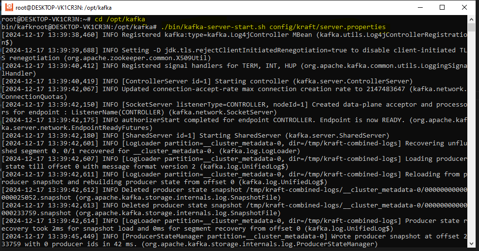

# Streaming Data Pipeline for Toll Plaza Traffic Using Kafka and MariaDB

## Project Overview
This project involves building a real-time streaming data pipeline that simulates the collection of vehicle traffic data from toll plazas. The traffic data is generated using Python, streamed through **Apache Kafka**, and stored in a **MariaDB** database for further analysis. The system ensures data is processed efficiently and can be used for real-time decision-making in traffic monitoring and toll plaza management.

---

## Objective

1. **Simulate Traffic Data Generation**  
   - Randomly generate data to represent vehicles passing through various toll plazas.

2. **Stream the Generated Data**  
   - Use **Apache Kafka** for ingestion and streaming of the data to various consumers.

3. **Store the Processed Data**  
   - Store the data in a **MariaDB** database for structured query and reporting.

4. **Ensure Data Integrity**  
   - Implement verifications that ensure the pipeline runs smoothly with correct data being processed.

---

## Tools and Technologies

- **Apache Kafka**  
   A distributed streaming platform used to publish and subscribe to streams of records.

- **MariaDB**  
   A MySQL-compatible relational database used to store the processed traffic data.

- **Python**  
   Scripting language for creating the Kafka producer/consumer and data generation logic.

- **WSL (Windows Subsystem for Linux)**  
   Used for running the necessary database and Kafka environment on Windows.

- **Faker**  
   A library used to generate realistic but random traffic data.

  ## Setup

### Prerequisites
Ensure the following components are installed before proceeding:

1. **Install MariaDB**

   On **Ubuntu (WSL)**, run the following commands:

   ```bash
   sudo apt update
   sudo apt install mariadb-server


2.  **Download and Set Up Apache Kafka 3.9.0**


- ***Change to the `/tmp` directory to download the Kafka package:***
  
    ```bash
    cd /tmp
    ```

    Download the Kafka binary for Scala 2.13:

    ```bash
    wget https://downloads.apache.org/kafka/3.9.0/kafka_2.13-3.9.0.tgz
    ```
    
    Extract the downloaded Kafka archive:
    
    ```bash
    tar -xvzf kafka_2.13-3.9.0.tgz
    ```
    This will create a directory named kafka_2.13-3.9.0.

- ***Move Kafka to the `/opt` Directory***
   
   Move the extracted Kafka directory to `/opt`:

    ```bash
    sudo mv kafka_2.13-3.9.0 /opt/
    ```
    I will change **kafka_2.13-3.9.0** to **kafka** using the following command
   ```bash
   mv /opt/kafka_2.13-3.9.0 /opt/kafka
   ```

- ***Verify Kafka Installation***

    List the files in the `/opt` directory to confirm Kafka has been moved successfully:

    ```bash
    ls /opt
    ```

   
   from the above image, it is clear that kafka_2.13-3.9.0 successfully downloaded 
   
3 **Install Python Drivers and Libraries**
- ***Kafka Python Driver***:
  
  I used confluent-kafka, which is more performant and reliable
  ```bash
  pip install confluent-kafka
  ```
- ***Python Virtual Environment***
  ```bash
    python3 -m venv myenv
    source myenv/bin/activate
  ```

- ***MySQL(Mariadb) Python Driver***:

  I used mariadb as python-connector, but before that i had to install ***mariadb-server mariadb-client libmariadb-dev***
  ```bash
  sudo apt-get install mariadb-server mariadb-client libmariadb-dev
  ```
  and after that i checked the location of the mariadb_config using the ***which*** command
  ```bash
  which mariadb_config
  ```
  the Output ***/usr/bin/mariadb_config*** showed the exact location, so I had to move the MARIADB_CONFIG to /usr/bin/mariadb_config
  ```bash
   export MARIADB_CONFIG=/usr/bin/mariadb_config
  ```
  and then Lastly, 
  
  ```bash
  pip install mariadb
  ```


-   ***faker***
   I used faker to be able to generate random/unique data values

  ```bash
   pip install faker
  ```


---

## Step-by-Step Pipeline Setup

### Phase 1: Kafka Setup in KRaft Mode

Kafka in **KRaft mode** does not rely on Zookeeper. Instead, the Kafka broker acts as both the broker and controller. Below are the steps to configure and start Kafka in KRaft mode.

---

### 1.1 **Configure Kafka for KRaft Mode**

I Modified the `kraft/server.properties` configuration file to include the following settings:

```properties
listeners=PLAINTEXT://localhost:9092,CONTROLLER://localhost:9093
advertised.listeners=PLAINTEXT://localhost:9092,CONTROLLER://localhost:9093

# Controller listener (separate port)
listener.security.protocol.map=PLAINTEXT:PLAINTEXT
listener.name.controller=PLAINTEXT
listeners=PLAINTEXT://localhost:9092,PLAINTEXT://localhost:9093
advertised.listeners=PLAINTEXT://localhost:9092,PLAINTEXT://localhost:9093

# Controller configuration (make sure the controller port is separate)
controller.listener.names=CONTROLLER
inter.broker.listener.name=PLAINTEXT
controller.quorum.voters=1@localhost:9093

# Directories for logs and metadata
log.dirs=/var/lib/kafka-logs
metadata.log.dir=/var/lib/kafka-metadata

# KRaft mode enabled
KRaft.mode=true
node.id=1

# Kafka roles in KRaft mode (Broker and Controller)
process.roles=broker,controller
kafka.cluster.id=e9ae6dbd-df6a-4a7e-a92b-48aede607e5a
```

### 1.2 **Start Kafka in KRaft Mode**

- I opened a new Terminal,
- Changed directory to ***/opt/Kafka***
  ```bash
  cd /opt/kafka
  ```
- Start Kafka
  ```bash
  cd /opt/kafka
  ./bin/kafka-server-start.sh config/kraft/server.properties
  ```

Kafka is running successfully!

### 1.3 **Create Kafka Topic Using `confluent_kafka.admin` (KRaft)**

Once Kafka was up and running in **KRaft mode**, I programmatically created the topic using the `confluent_kafka` Python library. This library simplifies Kafka topic management.
I used the code command to create the python script ***toll_admin.py*** and also open the script in a ***VSCODE editor*** using
```bash
python3 -m venv myenv
source myenv/bin/activate
code toll_admin.py
```
I copied the code below to the ***toll_admin.py*** script to create a new topic ***toll_data***:

```python
from confluent_kafka.admin import AdminClient, NewTopic

# Step 1: Configure the Kafka AdminClient
admin_client = AdminClient({
    "bootstrap.servers": "localhost:9092"  # Replace with your broker details if needed
})

# Step 2: Define the new topic
new_topic = NewTopic("toll_data", num_partitions=1, replication_factor=1)

# Step 3: Create the topic
print("Creating topic 'toll_data'...")
response = admin_client.create_topics([new_topic])

# Step 4: Verify topic creation
for topic, future in response.items():
    try:
        future.result()  # Blocks until Kafka confirms topic creation
        print(f"Topic '{topic}' created successfully.")
    except Exception as e:
        print(f"Failed to create topic '{topic}': {e}")
```
### 1.4 **Verify Kafka Topic Creation**

After running the script to create the topic, I confirmed its successful creation by listing the available topics in Kafka. To do this, I ran the following command:

```bash
bin/kafka-topics.sh --list --bootstrap-server localhost:9092
```

---

## Phase 2: MariaDB Setup
This is the phase were I set up the database that will recieve the streaming data. i performed the following steps to achieve it.

### 2.1 **Install and Start MariaDB**
Start MariaDB service using the following command:

```bash
sudo service mariadb start
```
### 2.2 **Log in to MariaDB**

I run the following command to log in as the root user:

```bash
mysql -u root -p
```
### 2.3 **Create a database called traffic_db**
```sql
CREATE DATABASE traffic_db;
```
### 2.4 **Create the table to store toll data:**

```sql
USE traffic_db;
CREATE TABLE toll_data (
    id INT AUTO_INCREMENT PRIMARY KEY,
    vehicle_id VARCHAR(50) NOT NULL,
    vehicle_type VARCHAR(20) NOT NULL,
    toll_plaza_id VARCHAR(50) NOT NULL,
    timestamp DATETIME NOT NULL
);
```
### 2.5 **Create a database use**
This was majorly to create a User traffic_user that with password has access to the database.
```sql
CREATE USER 'traffic_user'@'localhost' IDENTIFIED BY 'secure_password';
GRANT ALL PRIVILEGES ON traffic_db.* TO 'traffic_user'@'localhost';
FLUSH PRIVILEGES;
```
## Phase 3: Data Simulation and Streaming
###  3.1 **Kafka Producer (Data Generation)**
Now, we'll simulate traffic data using the Faker library. Here's a Python script for generating data and pushing it to the Kafka topic toll
```python
from confluent_kafka import Producer
from faker import Faker
import json
import time
import random

# Initialize Faker
fake = Faker()

# Kafka configuration
conf = {'bootstrap.servers': 'localhost:9092'}
producer = Producer(conf)

# Define the message delivery callback
def delivery_report(err, msg):
    if err:
        print(f"Delivery failed for {msg.key()}: {err}")
    else:
        print(f"Message delivered to {msg.topic()} [{msg.partition()}] at offset {msg.offset()}")

def generate_vehicle_data():
    vehicle_types = ['Car', 'Truck', 'Motorcycle', 'Bus']
    return {
        'vehicle_id': fake.uuid4(),
        'vehicle_type': random.choice(vehicle_types),
        'toll_plaza_id': f"TP{random.randint(1, 10):03}",
        'timestamp': fake.date_time().isoformat()
    }

if __name__ == "__main__":
    try:
        while True:
            vehicle_data = generate_vehicle_data()
            # Send data to the Kafka topic
            producer.produce('toll', key=vehicle_data['vehicle_id'], value=json.dumps(vehicle_data), callback=delivery_report)
            producer.poll(0)
            time.sleep(random.uniform(0.5, 2))  # Simulate traffic with random delays
    except KeyboardInterrupt:
        print("Producer interrupted")
    finally:
        producer.flush()
```
Execute this script by running:
###  3.2 **Execute this script by running:**
```python
python producer.py
```

## Phase 4: Kafka Consumer (Data Ingestion into MariaDB)
##   4.1 **Kafka Consumer**
Now, we will create a Python consumer script to consume messages from Kafka and insert them into the MariaDB database. This will handle each message, parse it, and store it in the toll_data table.
```python
from confluent_kafka import Consumer, KafkaException
import mariadb
import json

# Kafka configuration
conf = {
    'bootstrap.servers': 'localhost:9092',
    'group.id': 'toll_consumer_group',
    'auto.offset.reset': 'earliest'
}

consumer = Consumer(conf)
consumer.subscribe(['toll'])

# MySQL configuration
db_config = {
    'user': 'traffic_user',
    'password': 'secure_password',
    'host': '127.0.0.1',
    'database': 'traffic_db',
    
}

# Connect to MySQL
cnx = mariadb.connect(**db_config)
cursor = cnx.cursor()

insert_stmt = (
    "INSERT INTO toll_data (vehicle_id, vehicle_type, toll_plaza_id, timestamp) "
    "VALUES (?, ?, ?, ?)"
)

def consume_messages():
    try:
        while True:
            msg = consumer.poll(1.0)  # Timeout in seconds
            if msg is None:
                continue
            if msg.error():
                if msg.error().code() == KafkaException._PARTITION_EOF:
                    # End of partition event
                    continue
                else:
                    print(msg.error())
                    break
            else:
                # Proper message
                data = json.loads(msg.value().decode('utf-8'))
                record = (
                    data['vehicle_id'],
                    data['vehicle_type'],
                    data['toll_plaza_id'],
                    data['timestamp']
                )
                try:
                    cursor.execute(insert_stmt, record)
                    cnx.commit()
                    print(f"Inserted record for vehicle_id: {data['vehicle_id']}")
                except mysql.connector.Error as err:
                    print(f"Error: {err}")
                    cnx.rollback()
    except KeyboardInterrupt:
        print("Consumer interrupted")
    finally:
        consumer.close()
        cursor.close()
        cnx.close()

if __name__ == "__main__":
    consume_messages()
```
##   4.1 *Run the consumer with:**
```bash
python consumer.py
```

##   Verification
###   Step 1: **Verify Insertion in MariaDB**
After running the producer and consumer, I'll verify if the data is inserted into the MariaDB table:
```bash
mysql -u traffic_user -p
USE traffic_db;
SELECT * FROM toll_data ORDER BY id DESC LIMIT 10;
```


    


    


