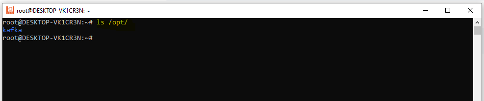
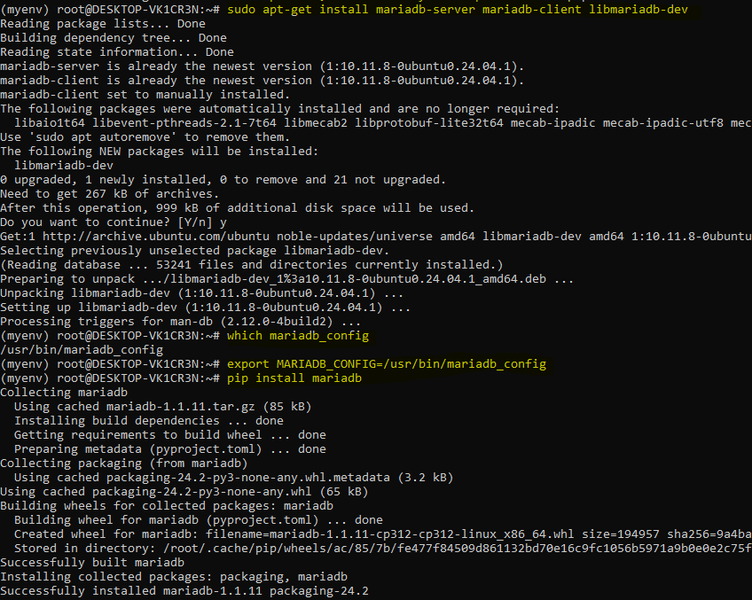
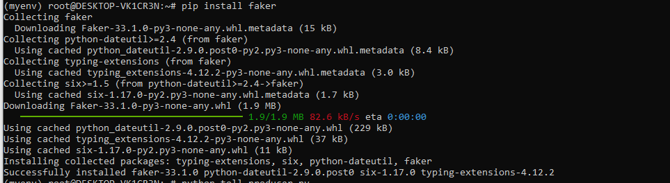

# Streaming Data Pipeline for Toll Plaza Traffic Using Kafka and MariaDB

## Project Overview
This project involves building a real-time streaming data pipeline that simulates the collection of vehicle traffic data from toll plazas. The traffic data is generated using Python, streamed through **Apache Kafka**, and stored in a **MariaDB** database for further analysis. The system ensures data is processed efficiently and can be used for real-time decision-making in traffic monitoring and toll plaza management.

---

## Objective

1. **Simulate Traffic Data Generation**  
   - Randomly generate data to represent vehicles passing through various toll plazas.

2. **Stream the Generated Data**  
   - Use **Apache Kafka** for ingestion and streaming of the data to various consumers.

3. **Store the Processed Data**  
   - Store the data in a **MariaDB** database for structured query and reporting.

4. **Ensure Data Integrity**  
   - Implement verifications that ensure the pipeline runs smoothly with correct data being processed.

---

## Tools and Technologies

- **Apache Kafka**  
   A distributed streaming platform used to publish and subscribe to streams of records.

- **MariaDB**  
   A MySQL-compatible relational database used to store the processed traffic data.

- **Python**  
   Scripting language for creating the Kafka producer/consumer and data generation logic.

- **WSL (Windows Subsystem for Linux)**  
   Used for running the necessary database and Kafka environment on Windows.

- **Faker**  
   A library used to generate realistic but random traffic data.

  ## Setup

### Prerequisites
Ensure the following components are installed before proceeding:

1. **Install MariaDB**

   On **Ubuntu (WSL)**, run the following commands:

   ```bash
   sudo apt update
   sudo apt install mariadb-server


2.  **Download and Set Up Apache Kafka 3.9.0**


- ***Change to the `/tmp` directory to download the Kafka package:***
  
    ```bash
    cd /tmp
    ```

    Download the Kafka binary for Scala 2.13:

    ```bash
    wget https://downloads.apache.org/kafka/3.9.0/kafka_2.13-3.9.0.tgz
    ```
    
    Extract the downloaded Kafka archive:
    
    ```bash
    tar -xvzf kafka_2.13-3.9.0.tgz
    ```
    This will create a directory named kafka_2.13-3.9.0.

- ***Move Kafka to the `/opt` Directory***
   
   Move the extracted Kafka directory to `/opt`:

    ```bash
    sudo mv kafka_2.13-3.9.0 /opt/
    ```
    I will change **kafka_2.13-3.9.0** to **kafka** using the following command
   ```bash
   mv /opt/kafka_2.13-3.9.0 /opt/kafka
   ```

- ***Verify Kafka Installation***

    List the files in the `/opt` directory to confirm Kafka has been moved successfully:

    ```bash
    ls /opt
    ```

   
   from the above image, it is clear that kafka_2.13-3.9.0 successfully downloaded 
   
3 **Install Python Drivers and Libraries**
- ***Kafka Python Driver***:
  
  I used confluent-kafka, which is more performant and reliable
  ```bash
  pip install confluent-kafka
  ```
- ***Python Virtual Environment***
  ```bash
    python3 -m venv myenv
    source myenv/bin/activate
  ```

- ***MySQL(Mariadb) Python Driver***:

  I used mariadb as python-connector, but before that i had to install ***mariadb-server mariadb-client libmariadb-dev***
  ```bash
  sudo apt-get install mariadb-server mariadb-client libmariadb-dev
  ```
  and after that i checked the location of the mariadb_config using the ***which*** command
  ```bash
  which mariadb_config
  ```
  the Output ***/usr/bin/mariadb_config*** showed the exact location, so I had to move the MARIADB_CONFIG to /usr/bin/mariadb_config
  ```bash
   export MARIADB_CONFIG=/usr/bin/mariadb_config
  ```
  and then Lastly, 
  
  ```bash
  pip install mariadb
  ```


-   ***faker***
   I used faker to be able to generate random/unique data values

  ```bash
   pip install faker
  ```


---

## Step-by-Step Pipeline Setup

### Phase 1: Kafka Setup in KRaft Mode

Kafka in **KRaft mode** does not rely on Zookeeper. Instead, the Kafka broker acts as both the broker and controller. Below are the steps to configure and start Kafka in KRaft mode.

---

### 1.1 **Configure Kafka for KRaft Mode**

I Modified the `kraft/server.properties` configuration file to include the following settings:

```properties
listeners=PLAINTEXT://localhost:9092,CONTROLLER://localhost:9093
advertised.listeners=PLAINTEXT://localhost:9092,CONTROLLER://localhost:9093

# Controller listener (separate port)
listener.security.protocol.map=PLAINTEXT:PLAINTEXT
listener.name.controller=PLAINTEXT
listeners=PLAINTEXT://localhost:9092,PLAINTEXT://localhost:9093
advertised.listeners=PLAINTEXT://localhost:9092,PLAINTEXT://localhost:9093

# Controller configuration (make sure the controller port is separate)
controller.listener.names=CONTROLLER
inter.broker.listener.name=PLAINTEXT
controller.quorum.voters=1@localhost:9093

# Directories for logs and metadata
log.dirs=/var/lib/kafka-logs
metadata.log.dir=/var/lib/kafka-metadata

# KRaft mode enabled
KRaft.mode=true
node.id=1

# Kafka roles in KRaft mode (Broker and Controller)
process.roles=broker,controller
kafka.cluster.id=e9ae6dbd-df6a-4a7e-a92b-48aede607e5a
```

### 1.2 **Start Kafka in KRaft Mode**

- I opened a new Terminal,
- Changed directory to ***/opt/Kafka***
  ```bash
  cd /opt/kafka
  ```
- Start Kafka
  ```bash
  cd /opt/kafka
  ./bin/kafka-server-start.sh config/kraft/server.properties
  ```


    


    


